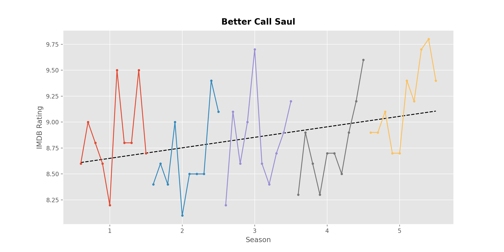
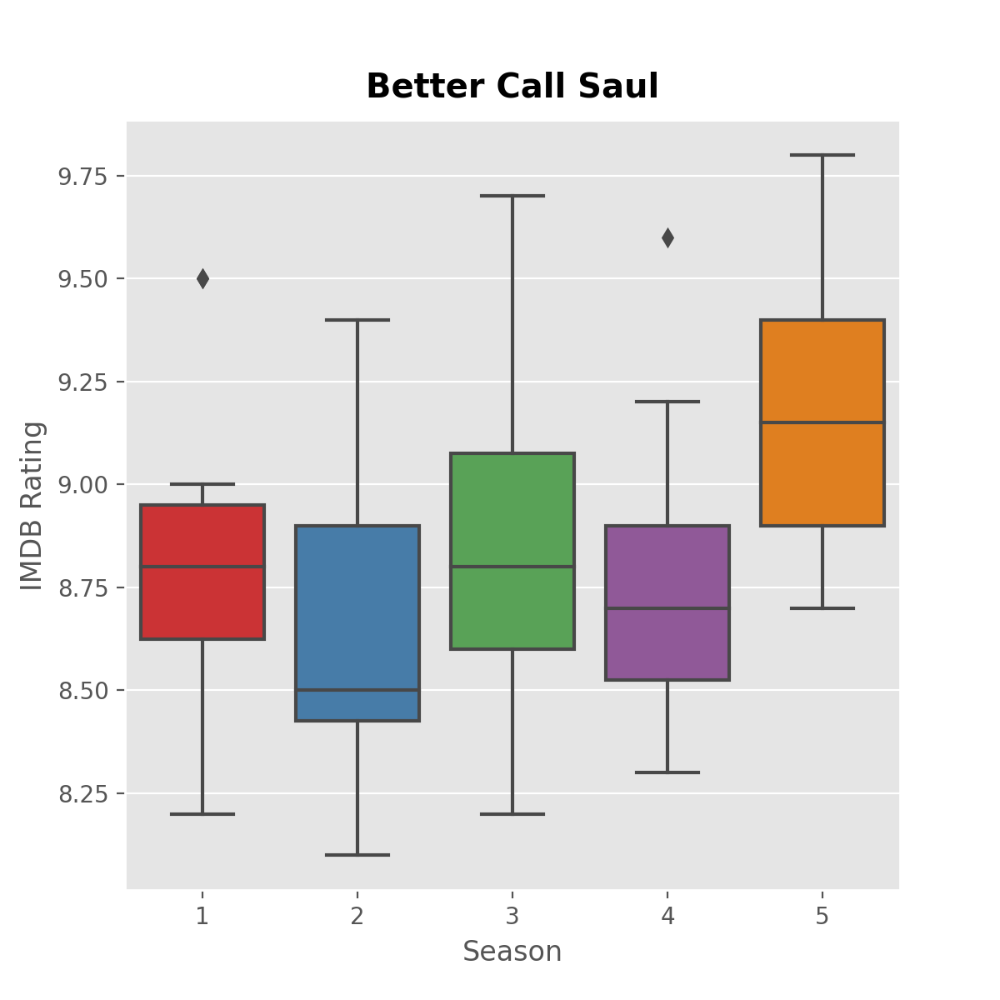
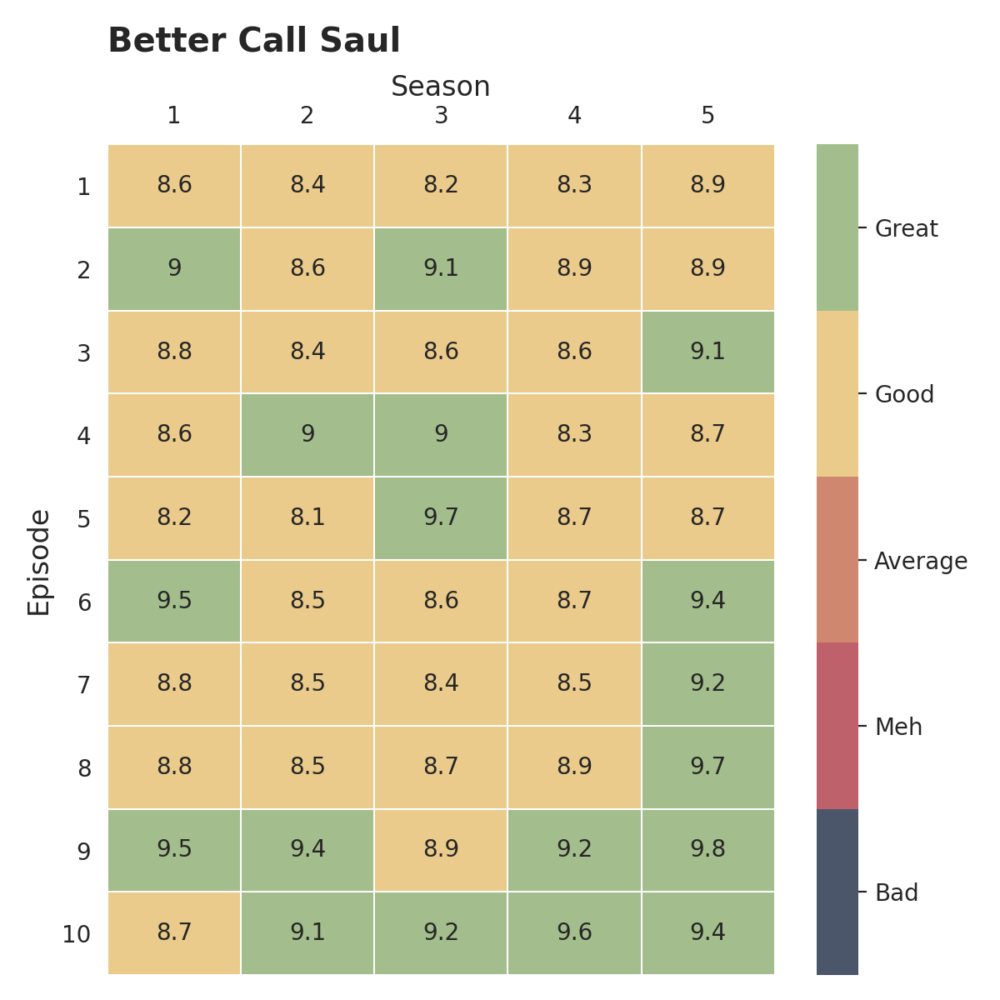

# TV Scrape

Scrape web data from IMDB for any TV show and generate visualizations on the fly.

## How it Works

Run tv_scrape.py (located in src folder) in the terminal or command line.  You will be prompted to enter a URL for a TV Show's home page on IMDB website.

The python script will then loop through the Episode List of each season and pull data for each episode including episode title, air date, rating, number of votes, and episode description.

All data scraped from IMDB will be written to a csv file.

In addition to the csv file, three (3) figures will be generated and saved as png files: time series, box plot, and heat map. 

Data and figures will be saved in a folder on your local computer here -> /Documents/tv_show_data

## Key Python Packages

- Requests and Beautiful Soup are used to parse data from IMDB web pages
- Pandas is used to store data, write it to csv, and manipulate as needed for plots
- Matplotlib is used to create all figures from data

## Control of Request Rate

Please note that this script controls the request rate while scraping IMDB. This is done to avoid hammering the IMDB server with too many requests per second. Hitting a server with too many requests at a time can disrupt website activity and actually lead to your IP address getting banned from that website. 

While this step may be unnecessary for pulling data for a single TV show, as the number of requests will be relatively small, I think its best to play it safe.

As a result, this script takes longer than it would otherwise.  Frequency of requests per second are monitored and updates are given to user as script loops through each Season's web page.  

 

## How to Run on your System  

You will need Python 3 installed on your system as well as a number of python packages.

You can clone this repository into a newly created directory on your local system. From there, I would recommend creating a virtual environment in this new directory. 

All python packages needed are stored in the requirements.txt file of this repository. Once your virtual environment is created and you have it activated, you can run the below command in your terminal to install all packages in one shot.

pip install -r requirements.txt

If you are new to virtual environments, I would highly recommend the below two videos by Corey Schafer (all of his python videos on youtube are superb).

https://www.youtube.com/watch?v=Kg1Yvry_Ydk (Mac & Linux)\
https://www.youtube.com/watch?v=APOPm01BVrk (Windows)

## Acknowledgments

This was built for educational purposes only. I was able to grow many different data science skills all in one project!

See the below resources I used as references to help build this project.

https://www.youtube.com/watch?v=UO98lJQ3QGI (Part 1 of Corey Schafer's Matplotlib Tutorial)\
https://www.youtube.com/watch?v=ZyhVh-qRZPA (Part 1 of Corey Schafer's Pandas Tutorial)\
https://www.youtube.com/watch?v=ng2o98k983k (Corey Schafer's Web Scraping Tutorial)\
https://www.dataquest.io/blog/web-scraping-beautifulsoup/ (Alex Olteanu's IMDB Web Scraping Tutorial)\
https://towardsdatascience.com/scraping-tv-show-epsiode-imdb-ratings-using-python-beautifulsoup-7a9e09c4fbe5?gi=8ea7c0994ca5 (Isabella Benabaye's IMDB Web Scraping Tutorial)